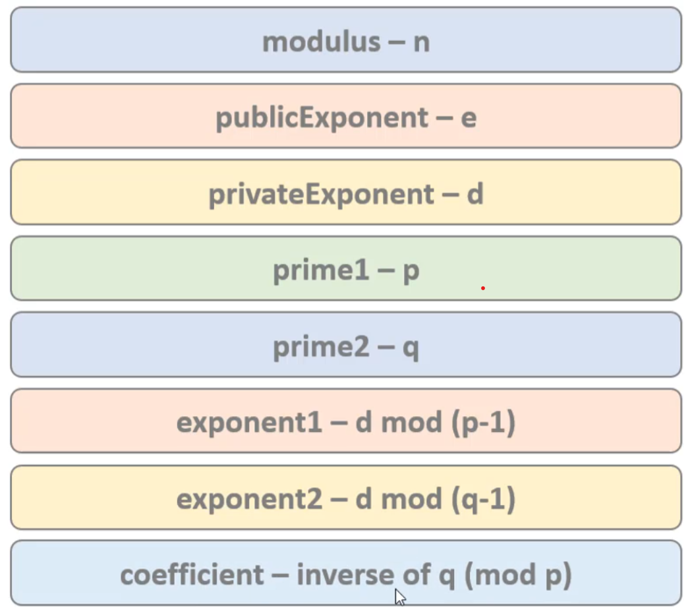

# RSA

## 生成RSA密钥
- openssl genrsa -out private-key.pem 2048 # Generate private key

## 查看密钥信息
- openssl rsa -in private-key.pem -text # View private key details
- openssl rsa -in private-key.pem -text -noout # View private key details, without private key appended to output
### 输出解析

## 提取公钥
- openssl rsa -in private-key.pem -pubout # Generate public key
- openssl rsa -in private-key.pem -pubout -out public-key.pem # Generate public key

## 加解密测试
- openssl pkeyutl -encrypt -inkey public-key.pem -pubin -in file.txt -out encrypted-file.txt #使用公钥加密文件
- openssl pkeyutl -decrypt -inkey private-key.pem -in encrypted-file.txt -out decrypted-file.txt #使用私钥解密文件

# ECC

# Generate CSR (Certificate Signing Request)
- openssl req -new -key private-key.pem -out csr.pem # Generate CSR (Certificate Signing Request)
- openssl x509 -req -days 365 -in csr.pem -signkey private-key.pem -out certificate.pem # Generate Certificate