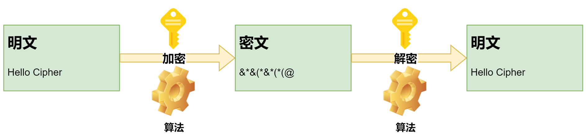
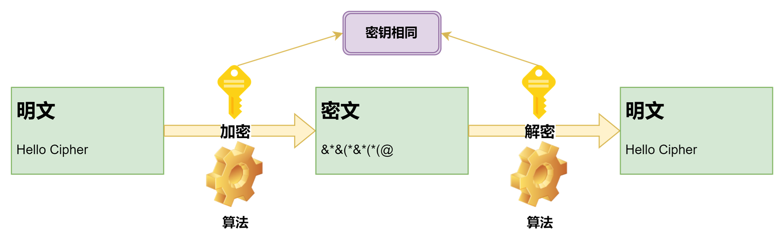
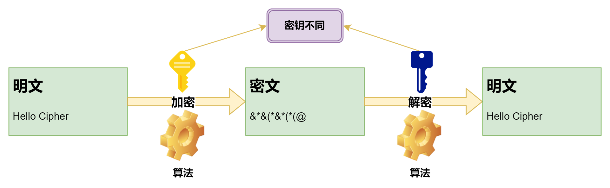

# 密码学

## 加密、解密

加密是把明文转换成密文的过程，而解密则是把密文转换成明文的过程。这个过程涉及到两个基本的工具：算法和密钥。算法通常是公开的，而密钥则是保密的。根据加密和解密时使用的密钥是否一样，可以将加密算法分为对称加密和非对称加密两类。

## 对称加密、非对称加密

1. 对称加密

加密和解密使用同一个密钥。常见的对称加密算法有DES、3DES、AES等。对称加密的缺点是通信双方必须事先商定好密钥，并且必须保证密钥的安全，而密钥交换通常并不容易。

2. 非对称加密

加密和解密使用不同的密钥，一个称为公钥，另一个称为私钥，公钥可以提供给任何人，而私钥必须保密。公钥加密的数据只能用私钥解密，私钥加密的数据只能用公钥解密。常见的非对称加密算法有RSA、ECC（Elliptic Curve Cryptography，椭圆曲线加密算法）等。其优点是私钥无需进行交换。

## 消息摘要
使用一种称为哈希函数的单向、不可逆函数，将任意长度的输入转换为固定长度的输出，该输出值被称为哈希值，也叫做消息摘要。对于好的哈希算法，即使输入只有微小的变化，其产生的哈希值也会有巨大的差异。常见的哈希函数有MD5、SHA-1、SHA-256等。这里需要指出的是，计算哈希并不是加密，哈希值是不能反向解密的。

消息摘要的功能是保证数据的完整性，也就是说接收到消息后，只需对其重新计算一下哈希值，然后和接收到的哈希值进行比对，就可以判断该消息是否被篡改过。
然而，如果修改了消息并对其重新计算哈希值，那么接收方就无法验证消息的完整性，这就需要一种更安全的验证方式，即数字签名。

## 数字签名

数字签名是一种消息认证技术，它可以验证消息的完整性、真实性和发送者的身份。数字签名的过程如下：

1. 发送方计算消息的哈希值，并用私钥对哈希值进行加密，得到签名。
2. 发送方将消息和签名一起发送给接收方。
3. 接收方使用发送方的公钥对签名进行解密，得到哈希值。
4. 接收方计算消息的哈希值，并与解密后的签名进行比对。如果两者相同，则可以确定消息的完整性、真实性和发送者的身份。

## 数字证书

数字证书是一种电子凭证，是被电子签名的，用于证明持有者的身份，提供持有者的信息，验证持有者公钥的合法性、有效性和完整性，并提供公钥的持有者信息。数字证书的颁发机构必须受到公信力的保障，并且必须严格遵守相关法律法规。
证书中包含的信息可以分为三类：
1. 持有者相关的信息， 如持有者的名称，持有者的公钥，
2. 证书颁发者的信息，如颁发机构的名称
3. 证书本身的信息，如证书的序列号，证书的有效期，颁发机构对证书做的签名，证书的用途

## x509证书格式
### version
版本号，目前版本为v3。 v1不能包含任何扩展信息，v3可以包含扩展信息
### serialNumber
证书序列号，唯一标识证书，是CA分配的
### signatureAlgorithm
签名算法，如SHA256WithRSA
### issuer
颁发者信息，如证书颁发机构的名称，
### validity
证书有效期，包括起始时间和结束时间
### subject
主题信息即证书的标识名信息，包含的信息有：CN-common name，O-organization，L-locality or city，S：state or province，C-country name
### subjectPublicKeyInfo
公钥信息，包括公钥算法、公钥值
### extensions
扩展信息，如主要用途(key usages), Authority Key Identifier(AKI)是签发该证书的CA的Key Identifier，这个值和CA证书中的Subject Key Identifier相同。Subject Key Identifier(SKI)是subject public key的哈希值，是标识包含某个特定公钥的证书的方式。 基本约束(basic constraints)标识证书是不是一个CA证书，并说明它可以签发的证书链中中级CA证书数目的上限。
#### Key Usages
- digitalSignature 用于数据的认证，保证数据完整性，不能用于证书的签发和验证，也就是说可以对消息做签名并验证，但是不能签发证书。
- keyEncipherment 用于加密密钥，如在TLS中用于加密对称密钥。
- dataEncipherment 用于加密数据，如在TLS中用于加密数据。但不能加密密钥
- keyCertSign 用于签发证书并验证证书，只能用在CA证书中。
- keyAgreement 用于密钥协商，如在TLS中和Diffie-Hellman算法一起用于生成共享密钥。

### Root Certificate
根证书是标识CA身份的证书，是自签名的证书，需要安装在操作系统的受信任根证书颁发机构列表中，会随着OS的更新而更新。
根证书的作用是验证证书的合法性，并为其他证书提供信任根。

### Intermediate Certificate
中间证书是CA颁发的证书，它是根证书的子证书，其作用也是颁发证书。

## 数字证书链
数字证书链是一系列的数字证书，它从根证书开始，依次向下直到签发者的证书，最后到达目标证书。
除了根证书，其他证书都是由别的证书所签发的，在签发时使用的是签发者的私钥，所以可以使用签发者的公钥进行验证。在验证证书时，从该证书开始，使用签发者的公钥验证，逐级进行，直到验证到根证书。

## 密钥交换

密钥交换是指不安全的通信通道上，协商出一个双方都能理解的密钥，即使有人获取到所有的通信消息也无法推算出密钥。常见的密钥交换算法有Diffie-Hellman、ECDHE（Elliptic Curve Diffie-Hellman，椭圆曲线密钥交换算法）等。

## PEM文件
PEM（Privacy Enhanced Mail）是二进制数据的base64编码，不关心二进制数据的格式或类型，所以几乎可以包含任意base64编码的文本，并以BEGIN和END标签进行标记。
PEM文件是一种常见的证书格式，它包含证书、公钥、私钥等信息。PEM文件以-----BEGIN CERTIFICATE-----开头，以-----END CERTIFICATE-----结尾。PEM文件可以用文本编辑器打开，也可以用openssl命令行工具查看。

## DER文件
DER（Distinguished Encoding Rules）文件以二进制格式创建和存储，它是X.509证书和私钥的二进制编码。和PEM文件不同，DER文件不包含人类可读的文本，如BEGIN PRIVATE KEY和END PRIVATE KEY标签。
DER是二进制数据的ASN.1编码，它严格遵守ASN.1语法，所以可以保证编码的可读性。DER文件是一种常见的证书格式，它包含证书、公钥、私钥等信息。DER文件以3082开头，以300D结尾。DER文件可以用文本编辑器打开，也可以用openssl命令行工具查看。